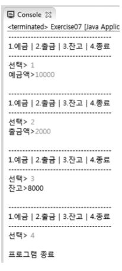

### 2018-08-07
- 변수 이름을 똑같이 할 필요는 없음
# 1.
### 문제 설명  
배열 `a`의 총 합계를 구하시오.
```java
int[] a = {5, 4, 6, 2, 12, 0 ,6, 3};
```
### 제한 조건
- 반복문을 사용하여, 배열의 길이를 반환하는 예)`array.length` 를 사용한다.
#### 출력 예
`sum = 38`


# 2.
### 문제 설명

1부터 입력받은 숫자 n 사이에 있는 소수의 개수를 반환하는 코드를 작성하시오.
소수는 1과 자기 자신으로만 나누어지는 수를 의미한다. (1은 소수가 아님)

### 제한 조건
- n은 2이상 1000000이하의 자연수

#### 출력 예
` n=10일때 4개 `   1부터 10사이의 소수는 2,3,5,7, 이니 4 반환
` n=5일때 3개`  1부터 5사이의 소수는 2,3,5 로 3반환

# 3.
### 문제 설명

반복문을 사용하여 아래의 출력과 같이 하시오.

### 출력 예

```
1 2 3 4  5  6  7  8  9 10
2 4 6 8 10 12 14 16 18 20
3 6 9 12 15 18 21 24 27 30
... (쓰기 귀찮아서 생략함)
...
...
10 20 30 40 50 60 70 80 90 100
```

# 4. 마지막

### 문제 설명
아래와 같은 예금, 출금, 조회, 종료 기능을 구현하시오.

### 출력 예


### 4번 힌트

```java
import java.util.Scanner;

public class Bank {  //클래스 이름은 첫글자 무조건 대문자로 ,걍 외워
  public static void main(String[] args){
    boolean run = true;
    int money=0;

   Scanner sc = new Scanner(System.in);

   while(run){
     System.out.println("-------------------------------");
     System.out.println("1. 예금 | 2. 출금 | 3. 잔고 | 4. 종료");
     System.out.println("-------------------------------");
     System.out.println("선택 >");

     int selectMenu = sc.nextInt();
     //sc라는 이름으로 Scanner(입력기능을 함)클래스를 호출하였다.
     //왜 sc.nextInt() 라는 함수를 사용했을까?

 /* 여기까지가 힌트,  알아서  조건문을 사용*/


   }
   System.out.println("프로그램 종료");
  }

}
```
