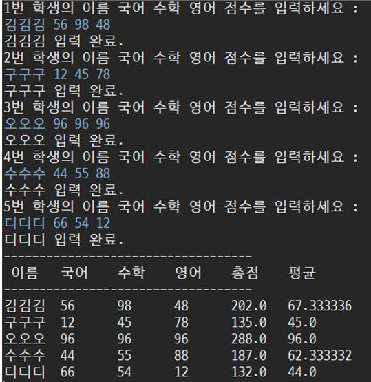
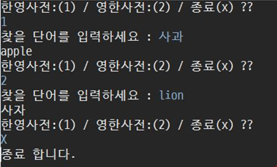

### 2018-08-14

# 배열배열배열배열
# 1.
### 문제 설명  
**배열** 을 사용하여 5명 학생의 성적을 국어, 수학, 영어에 대해 받아서 성적을 처리하는 프로그램을 작성
하시오. 사용자에게 이름, 국어, 수학, 영어를 입력받아서 처리하시오.


#### 출력 예


# 2.
### 문제 설명
**배열** 과 **for-each문** 을 사용하여 10개의 int 형 원소를 갖는 배열에 1~10까지 값을 저장하고 모든 원소
의 값을 더하는 프로그램을 작성하라.
#### 출력 예
```
정수 1 ~ 10 까지 더한 값은 55
```

# 3.
### 문제 설명
**배열** 을 이용하여 영어사전을 만들어보자. `사전에는 apple (사과), lion (사자), tiger (호랑이), ostrich
(타조), frog (개구리)가 있다`. 첫 번째, `영한사전, 한영사전을 선택` 할 수 있도록 해서 영한사전일 경우
apple이라고 사용자가 입력하면 사과라고 답해야 하고, 반대로 한영사전을 선택한 후 사자라고 입력하면 lion이라고 답할 수 있는 사전을 프로그래밍 하시오.

#### 출력 예

# 4.
### 문제 설명

**배열** 을 사용하여 중복되는 문자를 걸러내는 프로그램을 만드려 한다.
익숙한 `hello world` 문자열을 입력하면, `h, e, l, o, w, r, d` 의 문자가 출력되는 방식이다.
- 소문자 영어로 이루어진 단어를 입력한다.
- 걸러진 문자들은 입력 단어의 순서를 유지해야 한다.
### 출력 예
```
IN : what do you think
OUT : w, h, a, t, d, o, y, u, i, n, k
```
